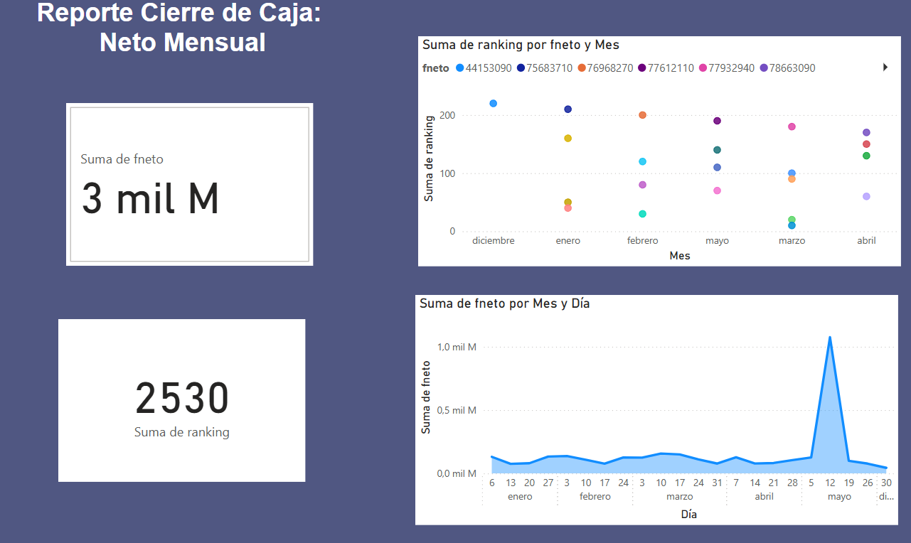
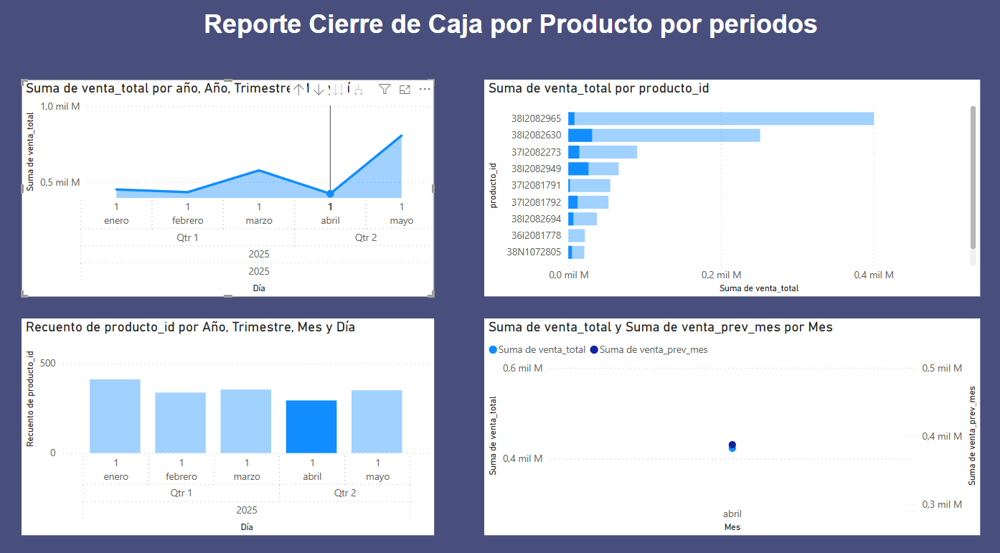
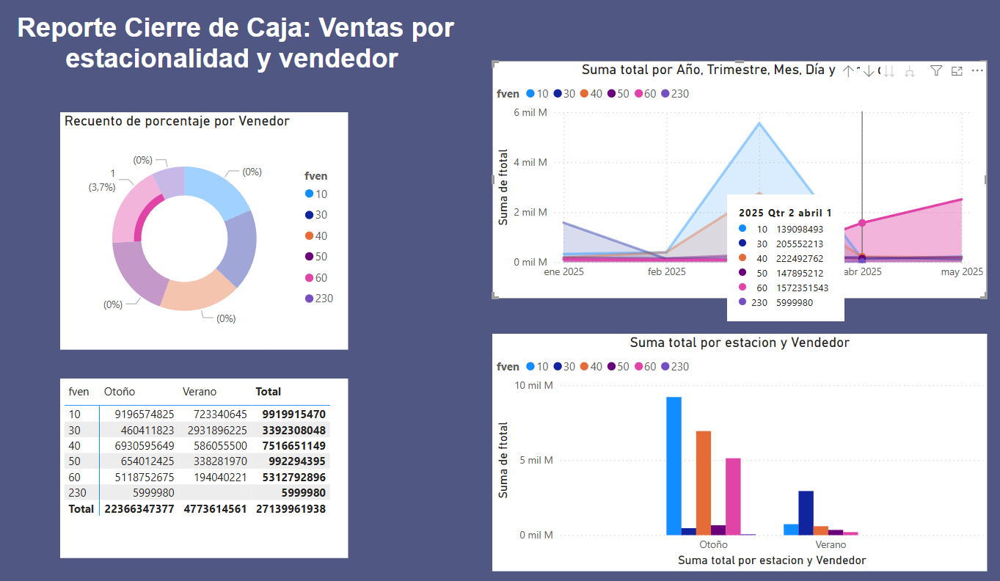
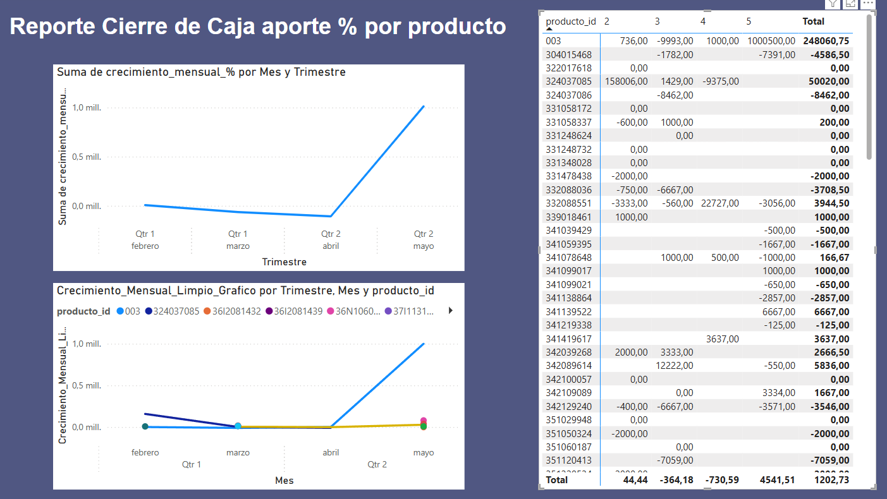
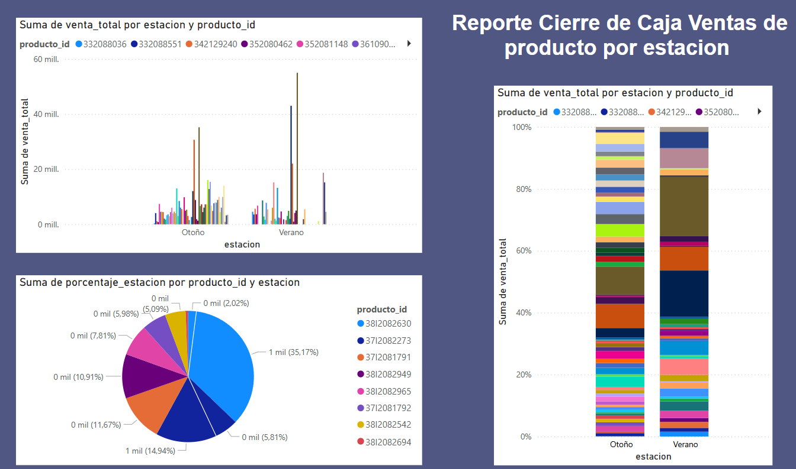

# Informe Proyecto Final: Cierre de Caja para Ventas

## 1. Introducción

Este informe presenta el análisis del cierre de caja y el rendimiento de ventas de un caso de estudio empresarial. El objetivo principal es proporcionar **información clara y accionable** sobre el desempeño de vendedores y productos, así como el impacto del comportamiento estacional en las ventas. La finalidad es empoderar la toma de decisiones estratégicas para la optimización de las estrategias comerciales y la mejora continua en la gestión del inventario.

---

## 2. Metodología y Herramientas Utilizadas

La creación de este sistema de inteligencia de negocios se llevó a cabo siguiendo un enfoque estructurado de ETL (Extracción, Transformación y Carga) y visualización, utilizando las siguientes herramientas:

* **Google BigQuery:** Empleado como el repositorio central para el almacenamiento y procesamiento escalable de los datos de ventas, asegurando la integridad y disponibilidad de la información.
* **Power Query (dentro de Power BI Desktop):** Utilizado para la fase de ETL, permitiendo la conexión a la fuente de datos, la limpieza, transformación y preparación de los datos brutos para su posterior análisis.
* **Power BI Desktop:** La plataforma principal para la modelación de datos, la definición de medidas (KPIs) y el desarrollo de los dashboards interactivos que visualizan el rendimiento de ventas.

---

## 3. Flujo de Datos y Modelo Conceptual

El modelo de datos se fundamenta en una tabla transaccional de ventas, la cual es enriquecida con información crucial como fechas de transacción, identificadores de vendedores, detalles de productos, y los montos totales y netos de cada venta.

A partir de esta fuente primaria, se generaron campos derivados como año, mes y la clasificación de estación meteorológica basada en la fecha de la transacción. El diseño del modelo sigue un esquema de estrella, compuesto por tablas de hechos (Facts) y tablas de dimensiones (Dims), optimizado para el análisis de ventas:

| Tipo        | Tabla / Dimensión                  | Descripción                                                                 |
| :---------- | :--------------------------------- | :-------------------------------------------------------------------------- |
| **Fact** | `ventas_mensuales_por_vendedor`    | Agrega las ventas totales consolidadas por mes y por vendedor.              |
| **Fact** | `ventas_por_estacion_y_vendedor`   | Consolida las ventas por período estacional y por cada vendedor.           |
| **Fact** | `ventas_producto_estacion`         | Registra las ventas detalladas de cada producto clasificadas por estación.  |
| **Fact** | `ventas_producto_mes`              | Almacena las ventas por producto, desglosadas por año y mes.                |
| **Dimensión** | `vendedor` (`fven`)                | Contiene los identificadores únicos y atributos relevantes de cada vendedor. |
| **Dimensión** | `producto` (`producto_id` / `fart`)| Incluye los identificadores y descripciones de cada producto.               |
| **Dimensión** | `tiempo` (año, mes, fecha completa)| Permite el análisis y la navegación a través de distintas granularidades temporales. |
| **Dimensión** | `estacion` (Primavera, Verano, etc.)| Proporciona la clasificación estacional de los datos de ventas.              |

---

## 4. Definición y Descripción de KPIs

Los Key Performance Indicators (KPIs) son métricas críticas diseñadas para medir y evaluar el rendimiento de ventas en diversos aspectos. Cada KPI se visualiza en reportes interactivos, los cuales se describen a continuación.

---

### 4.1. Reporte: Cierre de Caja - Neto Mensual

**Propósito:** Ofrecer una perspectiva general y detallada de la facturación neta, junto con el comportamiento de los rankings de ventas a nivel mensual y diario.

#### KPIs y Gráficos Destacados:

* **KPI: Neto Total Acumulado (`Suma de fneto`)**
    * **Visualización:** Tarjeta.
    * **Descripción:** Representa el valor monetario global acumulado de la facturación neta (`fneto`) para el período seleccionado en el informe.
    * **Utilidad Analítica:** Proporciona un indicador consolidado y de alto nivel sobre el volumen total de ingresos de la empresa.

* **KPI: Suma Total de Ranking (`Suma de ranking`)**
    * **Visualización:** Tarjeta.
    * **Descripción:** Presenta el valor agregado de la medida `ranking`, la cual indica la posición o importancia de un elemento (ej. producto, transacción) dentro de su categoría.
    * **Utilidad Analítica:** Su interpretación depende de la definición específica de `ranking`, pero generalmente señala un volumen o puntaje acumulado de relevancia.

* **Gráfico: Evolución Mensual del Ranking por Facturación Neta**
    * **Visualización:** Gráfico de Dispersión.
    * **Métricas:** Eje Y: `Suma de ranking` | Eje X: `Mes` | Puntos de color por `fneto`.
    * **Descripción:** Ilustra cómo el `ranking` se comporta mes a mes, mostrando su relación con los diferentes rangos de facturación neta (`fneto`).
    * **Utilidad Analítica:** Permite identificar correlaciones entre el volumen de ranking y los ingresos, así como detectar patrones o anomalías mensuales.

* **Gráfico: Tendencia Diaria de la Facturación Neta**
    * **Visualización:** Gráfico de Área.
    * **Métricas:** Eje Y: `Suma de fneto` | Eje X: `Mes` y `Día` (jerarquía de tiempo).
    * **Descripción:** Muestra la evolución diaria de los ingresos brutos (`fneto`) a lo largo del período cubierto por los datos (ej., enero a mayo de 2025).
    * **Utilidad Analítica:** Esencial para identificar picos y caídas en el flujo de ingresos diarios, permitiendo comprender la actividad comercial con alta granularidad temporal.

**Captura de Pantalla del Reporte:**


---

### 4.2. Reporte: Cierre de Caja por Producto por Periodos

**Propósito:** Analizar el rendimiento de las ventas por producto a lo largo del tiempo, facilitando comparativas entre diferentes períodos.

#### KPIs y Gráficos Destacados:

* **Gráfico: Tendencia de Venta Total por Periodo**
    * **Visualización:** Gráfico de Área.
    * **Métricas:** Eje Y: `Suma de venta_total` | Eje X: Jerarquía de tiempo (Año, Trimestre, Mes, Día).
    * **Descripción:** Ilustra la evolución temporal de la `venta_total` global, con datos desde enero hasta mayo de 2025.
    * **Utilidad Analítica:** Fundamental para identificar patrones generales de venta (crecimiento, declive), picos de rendimiento (como el observado en mayo) y la salud general de las ventas a lo largo del tiempo.

* **Gráfico: Ranking de Productos por Venta Total**
    * **Visualización:** Gráfico de Barras Horizontales.
    * **Métricas:** Eje X: `Suma de venta_total` | Eje Y: `producto_id`.
    * **Descripción:** Clasifica los productos en orden descendente según su volumen de `venta_total`, destacando los de mayor contribución.
    * **Utilidad Analítica:** Permite reconocer rápidamente los "productos estrella" de la empresa, lo cual es crucial para la gestión de inventario, la asignación de recursos de marketing y el diseño de estrategias comerciales.

* **Gráfico: Volumen de Productos Vendidos por Periodo**
    * **Visualización:** Gráfico de Columnas.
    * **Métricas:** Eje Y: `Recuento de producto_id` | Eje X: Jerarquía de tiempo (Año, Trimestre, Mes, Día).
    * **Descripción:** Muestra la cantidad de productos únicos vendidos o el número de transacciones que involucraron productos en cada período de tiempo.
    * **Utilidad Analítica:** Ofrece una perspectiva valiosa sobre la actividad de venta en términos de unidades o número de transacciones, complementando el análisis de valor monetario.

* **Gráfico: Comparación de Venta Total Actual vs. Venta Mes Previo**
    * **Visualización:** Gráfico de Dispersión / Eje Dual.
    * **Métricas:** Eje Y: `Suma de venta_total` | Eje Y Secundario: `Suma de venta_prev_mes` | Eje X: `Mes`.
    * **Descripción:** Compara el rendimiento de la `venta_total` del mes actual con la `venta_prev_mes` (venta del mes anterior) para identificar el crecimiento o decrecimiento.
    * **Utilidad Analítica:** Proporciona un indicador directo de la tendencia de crecimiento o contracción mensual y la efectividad de las acciones comerciales implementadas.

**Captura de Pantalla del Reporte:**


---

### 4.3. Reporte: Cierre de Caja - Ventas por Estacionalidad y Vendedor

**Propósito:** Evaluar el desempeño de ventas individual de los vendedores, considerando la influencia de la estacionalidad y su contribución porcentual general.

#### KPIs y Gráficos Destacados:

* **Gráfico: Distribución Porcentual por Vendedor**
    * **Visualización:** Gráfico de Anillo.
    * **Métricas:** Valores: `Recuento de porcentaje` | Leyenda: `fven` (Vendedor).
    * **Descripción:** Muestra la distribución porcentual de una métrica clave (denominada "porcentaje") atribuida a cada vendedor (`fven`).
    * **Utilidad Analítica:** Permite entender la proporción de esta métrica específica que cada vendedor aporta. Si se observan muchos valores en 0%, sugiere una revisión de la definición de la métrica `porcentaje` o de la calidad de los datos.

* **Gráfico: Tendencia Temporal de Facturación por Vendedor**
    * **Visualización:** Gráfico de Área.
    * **Métricas:** Eje Y: `Suma de ftotal` (Facturación Total) | Eje X: Jerarquía de tiempo (Año, Trimestre, Mes, Día) | Leyenda: `fven` (Vendedor).
    * **Descripción:** Presenta la evolución de la facturación total a lo largo del tiempo, con un desglose específico para el rendimiento de cada vendedor.
    * **Utilidad Analítica:** Facilita el monitoreo del desempeño individual, permitiendo identificar períodos de alto rendimiento o caídas, y comparar la contribución de cada vendedor.

* **Tabla: Detalle de Ventas por Vendedor y Estación**
    * **Visualización:** Matriz/Tabla.
    * **Métricas:** `Suma de ftotal` por `fven` (Vendedor) y `estacion` (Estación: Otoño, Verano). Incluye totales generales.
    * **Descripción:** Proporciona un desglose numérico detallado de la facturación total generada por cada vendedor, organizada por las estaciones "Otoño" y "Verano".
    * **Utilidad Analítica:** Ofrece un análisis preciso del rendimiento de ventas estacional por vendedor, esencial para la planificación estratégica y la evaluación de desempeño.

* **Gráfico: Comparativa de Facturación por Vendedor y Estación**
    * **Visualización:** Gráfico de Columnas Agrupadas.
    * **Métricas:** Eje Y: `Suma de ftotal` | Eje X: `estacion` | Leyenda: `fven` (Vendedor).
    * **Descripción:** Compara visualmente el desempeño de la facturación total de cada vendedor entre las diferentes estaciones.
    * **Utilidad Analítica:** Permite una identificación rápida de los vendedores que tienen mayor impacto o fortaleza en estaciones específicas.

**Captura de Pantalla del Reporte:**


---

### 4.4. Reporte: Cierre de Caja - Aporte % por Producto

**Propósito:** Analizar el crecimiento mensual y la contribución trimestral de los productos individuales.

#### KPIs y Gráficos Destacados:

* **Gráfico: Tendencia de Crecimiento Mensual General**
    * **Visualización:** Gráfico de Área.
    * **Métricas:** Eje Y: `Suma de crecimiento_mensual_%` | Eje X: `Mes` y `Trimestre`.
    * **Descripción:** Muestra la evolución del crecimiento mensual agregado de las ventas a lo largo de los trimestres, proporcionando una vista de la tendencia general.
    * **Utilidad Analítica:** Permite identificar épocas de alto o bajo crecimiento general, y detectar tendencias positivas o negativas en el rendimiento global de las ventas.

* **Gráfico: Crecimiento Mensual Individual por Producto**
    * **Visualización:** Gráfico de Líneas.
    * **Métricas:** Eje Y: `Crecimiento_Mensual_Limpio_Grafico` | Eje X: `Mes` y `Trimestre` | Leyenda: `producto_id`.
    * **Descripción:** Detalla la tendencia de crecimiento mensual para productos específicos. La medida `Crecimiento_Mensual_Limpio_Grafico` está optimizada para una visualización clara, limpiando valores nulos o cero.
    * **Utilidad Analítica:** Crucial para identificar productos con crecimiento sostenido, estancamiento o declive, lo que facilita la toma de decisiones específicas a nivel de producto.

* **Tabla: Aporte Trimestral de Productos**
    * **Visualización:** Matriz/Tabla.
    * **Métricas:** Valores monetarios (ventas/ingresos) por `producto_id` (Filas) y por Trimestre (Columnas). Incluye un total general.
    * **Descripción:** Proporciona un desglose detallado del aporte de cada producto en términos de ventas o ingresos para cada trimestre. La presencia de valores negativos indica devoluciones o ajustes contables.
    * **Utilidad Analítica:** Ofrece un análisis granular del rendimiento trimestral de cada producto, siendo valioso para la gestión de inventario y la formulación de estrategias de producto.

**Captura de Pantalla del Reporte:**


---

### 4.5. Reporte: Cierre de Caja - Ventas de Producto por Estación

**Propósito:** Analizar la distribución de ventas de productos según la estación, así como su composición porcentual dentro de cada período estacional.

#### KPIs y Gráficos Destacados:

* **Gráfico: Distribución de Venta Total por Producto y Estación (Barras Agrupadas)**
    * **Visualización:** Gráfico de Barras Agrupadas.
    * **Métricas:** Eje Y: `Suma de venta_total` | Eje X: `estacion` | Leyenda: `producto_id`.
    * **Descripción:** Muestra la contribución de la `venta_total` de cada `producto_id` dentro de las estaciones "Otoño" y "Verano", permitiendo comparar el volumen absoluto.
    * **Utilidad Analítica:** Permite identificar qué productos son más relevantes en cada estación en términos de volumen de ventas. Dado el número de productos, la leyenda puede ser densa.

* **Gráfico: Composición Porcentual de Ventas por Producto y Estación**
    * **Visualización:** Gráfico de Columnas 100% Apiladas.
    * **Métricas:** Eje Y: `Suma de venta_total` (como %) | Eje X: `estacion` | Leyenda: `producto_id`.
    * **Descripción:** Ilustra cómo se compone el 100% de la venta total en cada estación (`Otoño` y `Verano`) según el aporte porcentual de cada producto.
    * **Utilidad Analítica:** Es ideal para comprender la mezcla de productos que impulsan las ventas en cada estación y si esa composición varía significativamente entre ellas.

* **Gráfico: Contribución de Productos al Porcentaje Estacional**
    * **Visualización:** Gráfico de Anillo.
    * **Métricas:** Valores: `Suma de porcentaje_estacion` | Leyenda: `producto_id`.
    * **Descripción:** Muestra la contribución porcentual de cada producto a la métrica `porcentaje_estacion`, que representa el peso relativo de un producto dentro del comportamiento de ventas de una estación.
    * **Utilidad Analítica:** Ayuda a identificar los productos que ejercen un impacto más significativo en el comportamiento estacional general de las ventas.

**Captura de Pantalla del Reporte:**


---

## 5. Conclusiones y Recomendaciones

* **Conclusiones:**
Crecimiento Robusto de Facturación Neta con Fuerte Impulso en Mayo:

El Neto Total Acumulado (Suma de fneto) es de 3 mil M.
La Tendencia Diaria de la Facturación Neta muestra un crecimiento sostenido y un pico significativo en mayo de 2025, alcanzando aproximadamente 1.0 mil M en un solo día. Esto sugiere un evento o campaña de ventas particularmente exitosa en ese mes.
La Suma de venta_total (Reporte 2) también corrobora el fuerte aumento en mayo.
Variabilidad en el Ranking y su Relación con la Facturación:

La Suma Total de Ranking es de 2530.
La Evolución Mensual del Ranking por Fneto indica que la relación entre el ranking y la facturación neta (fneto) es inconsistente. Si bien hay meses con alto ranking y alto fneto, también hay variaciones donde un fneto similar se asocia con diferentes niveles de ranking. Esto podría requerir una reevaluación de cómo se calcula o interpreta el ranking en relación con los ingresos.
Identificación Clara de Productos de Alto Rendimiento y Estacionalidad Marcada:

El Gráfico: Top Productos por Venta Total revela un patrón Pareto, donde un pequeño número de producto_id (ej. 3812082965, 3812082273, 382082630) contribuyen con la mayor parte de la venta_total.
Las Ventas de Producto por Estación muestran que la distribución de la venta_total por producto_id cambia entre "Otoño" y "Verano". Esto es especialmente evidente en el Gráfico de Composición Porcentual de Ventas por Producto y Estación, donde la mezcla de productos que conforman el 100% de las ventas difiere significativamente entre las estaciones.
Disparidad en el Desempeño de Vendedores y su Impacto Estacional:

La Tabla de Detalle de Ventas por Vendedor y Estación muestra que el vendedor fven 10 tiene consistentemente la mayor Suma de ftotal en ambas estaciones (919,657,4825 en Otoño y 723,340,645 en Verano), seguido de fven 40. El vendedor fven 230 tiene una contribución mucho menor (599,9980 en total).
El Gráfico de Tendencia Temporal de Facturación por Vendedor (Reporte 3) corrobora que la contribución de la Suma de ftotal por vendedor es altamente desigual a lo largo del tiempo.
Necesidad de Gestión en Valores Negativos y Fluctuaciones de Crecimiento:

La Tabla: Aporte Trimestral de Productos revela la presencia de valores negativos en venta_total para varios producto_id en distintos meses y trimestres (ej. producto_id 32017618 con -993,00 en el mes 2, producto_id 304015468 con -7391,00 en el mes 5). Esto sugiere devoluciones, ajustes, o errores en el registro.
El Gráfico: Tendencia de Crecimiento Mensual General (Reporte 4) muestra un crecimiento volátil, con un fuerte descenso antes de un repunte significativo en el Qtr 2/abril-mayo.

* **Recomendaciones:**
Capitalizar el Impulso de Mayo y Analizar la Estacionalidad de la Demanda:

Acción: Realizar un análisis de causa raíz del pico de ventas de mayo para identificar factores replicables (ej., promociones específicas, eventos, lanzamientos de productos, estacionalidad del consumidor) y planificar estrategias similares para el próximo año.
Acción: Utilizar la Tendencia Diaria de la Facturación Neta para identificar patrones de venta intra-mensuales o semanales y optimizar la asignación de recursos (personal, inventario) en función de la demanda esperada.
Optimizar el Portafolio de Productos y Estrategias por Estación:

Acción: Dada la concentración de ventas en unos pocos producto_id, enfocar los esfuerzos de marketing y distribución en los "productos estrella" (ej., 3812082965, 3812082273) para maximizar su potencial.
Acción: Desarrollar estrategias de inventario específicas para cada estación, asegurando que los productos con alta demanda estacional estén disponibles y reduciendo el stock de productos de baja rotación fuera de temporada. Esto se desprende de la clara diferenciación de composición de ventas entre Otoño y Verano.
Desarrollar y Motivar a los Vendedores Menos Rendidores:

Acción: Implementar programas de capacitación y mentoría dirigidos a los vendedores con menor Suma de ftotal (ej., fven 230), enfocándose en las mejores prácticas de los vendedores de alto rendimiento (ej., fven 10, fven 40).
Acción: Analizar si las diferencias de desempeño estacional de los vendedores se deben a la asignación de territorios o a la habilidad para vender productos específicos en cada estación. Ajustar la estrategia de asignación o brindar entrenamiento especializado si es necesario.
Investigar y Corregir los Registros Negativos de Ventas:

Acción: Es prioritario investigar los valores negativos en la venta_total. Esto implica revisar los procesos de devoluciones, cancelaciones y ajustes contables para identificar la causa raíz y, si es un error, corregirlo.
Acción: Establecer un protocolo de monitoreo y auditoría para asegurar la precisión de los datos de ventas y minimizar el impacto de futuros valores negativos.
Monitorear la Volatilidad del Crecimiento Mensual:

Acción: Aunque hay crecimiento general, la volatilidad observada en el Crecimiento_Mensual_% sugiere la necesidad de identificar los factores que causan los descensos (ej., estacionalidad no capturada, competencia, eventos externos) para mitigar riesgos futuros.
Acción: Para los productos con crecimiento inestable, se recomienda un seguimiento más cercano y la implementación de micro-campañas o ajustes de precio para estabilizar su rendimient

---
## Consultas SQL en BigQuery

### Consulta 1: Ventas Mensuales por Vendedor

```sql
WITH ventas_filtradas AS (
  SELECT
    EXTRACT(YEAR FROM ffch) AS anio,
    EXTRACT(MONTH FROM ffch) AS mes,
    CAST(fven AS INT64) AS fven,
    ftotal
  FROM
    tu_dataset.tu_tabla
  WHERE
    fven IS NOT NULL AND ffch IS NOT NULL
),
ventas_agrupadas AS (
  SELECT
    anio, mes, fven,
    SUM(ftotal) AS ftotal
  FROM ventas_filtradas
  GROUP BY anio, mes, fven
),
totales_por_mes AS (
  SELECT
    anio, mes,
    SUM(ftotal) AS total_mes
  FROM ventas_agrupadas
  GROUP BY anio, mes
)
SELECT
  v.anio,
  v.mes,
  v.fven,
  v.ftotal,
  ROUND(v.ftotal / t.total_mes * 100, 2) AS porcentaje
FROM ventas_agrupadas v
JOIN totales_por_mes t
  ON v.anio = t.anio AND v.mes = t.mes
ORDER BY anio, mes, fven;
```

---

### Consulta 2: Ventas por Estación y Vendedor

```sql
WITH ventas_filtradas AS (
  SELECT
    EXTRACT(YEAR FROM ffch) AS anio,
    EXTRACT(MONTH FROM ffch) AS mes,
    CAST(fven AS INT64) AS fven,
    ftotal
  FROM tu_dataset.tu_tabla
  WHERE fven IS NOT NULL AND ffch IS NOT NULL
),
ventas_con_estacion AS (
  SELECT
    anio,
    CASE
      WHEN mes IN (12, 1, 2) THEN 'Verano'
      WHEN mes IN (3, 4, 5) THEN 'Otoño'
      WHEN mes IN (6, 7, 8) THEN 'Invierno'
      ELSE 'Primavera'
    END AS estacion,
    fven,
    ftotal
  FROM ventas_filtradas
)
SELECT
  anio,
  estacion,
  fven,
  SUM(ftotal) AS ftotal
FROM ventas_con_estacion
GROUP BY anio, estacion, fven
ORDER BY anio, estacion, fven;
```

---

### Consulta 3: Ventas por Producto, Estación y Crecimientos

```sql
WITH ventas_filtradas AS (
  SELECT
    fart AS producto_id,
    fneto,
    EXTRACT(YEAR FROM ffch) AS anio,
    EXTRACT(MONTH FROM ffch) AS mes
  FROM tu_dataset.tu_tabla
  WHERE fneto IS NOT NULL AND ffch IS NOT NULL
),
ventas_con_estacion AS (
  SELECT
    producto_id,
    fneto,
    anio,
    mes,
    CASE
      WHEN mes IN (12, 1, 2) THEN 'Verano'
      WHEN mes IN (3, 4, 5) THEN 'Otoño'
      WHEN mes IN (6, 7, 8) THEN 'Invierno'
      ELSE 'Primavera'
    END AS estacion
  FROM ventas_filtradas
),
ventas_producto_estacion AS (
  SELECT
    producto_id,
    estacion,
    SUM(fneto) AS venta_total
  FROM ventas_con_estacion
  GROUP BY producto_id, estacion
),
ventas_producto_estacion_con_prev AS (
  SELECT
    producto_id,
    estacion,
    venta_total,
    LAG(venta_total) OVER (PARTITION BY producto_id ORDER BY
      CASE estacion
        WHEN 'Primavera' THEN 1
        WHEN 'Verano' THEN 2
        WHEN 'Otoño' THEN 3
        WHEN 'Invierno' THEN 4
      END
    ) AS venta_prev
  FROM ventas_producto_estacion
),
ventas_producto_estacion_crecimiento AS (
  SELECT
    producto_id,
    estacion,
    venta_total,
    venta_prev,
    ROUND(
      CASE
        WHEN venta_prev = 0 OR venta_prev IS NULL THEN NULL
        ELSE ((venta_total - venta_prev) / venta_prev) * 100
      END, 2
    ) AS crecimiento_estacional_pct
  FROM ventas_producto_estacion_con_prev
),
top_productos_estacion AS (
  SELECT *
  FROM (
    SELECT *,
      ROW_NUMBER() OVER (PARTITION BY estacion ORDER BY venta_total DESC) AS rn
    FROM ventas_producto_estacion_crecimiento
  )
  WHERE rn <= 5
),
ventas_producto_mes AS (
  SELECT
    producto_id,
    anio,
    mes,
    SUM(fneto) AS venta_total
  FROM ventas_filtradas
  GROUP BY producto_id, anio, mes
),
ventas_producto_mes_con_prev AS (
  SELECT
    producto_id,
    anio,
    mes,
    venta_total,
    LAG(venta_total) OVER (PARTITION BY producto_id ORDER BY anio, mes) AS venta_prev_mes
  FROM ventas_producto_mes
),
ventas_producto_mes_crecimiento AS (
  SELECT
    producto_id,
    anio,
    mes,
    venta_total,
    venta_prev_mes,
    ROUND(
      CASE
        WHEN venta_prev_mes = 0 OR venta_prev_mes IS NULL THEN NULL
        ELSE ((venta_total - venta_prev_mes) / venta_prev_mes) * 100
      END, 2
    ) AS crecimiento_mensual_pct
  FROM ventas_producto_mes_con_prev
)
SELECT * FROM top_productos_estacion ORDER BY estacion, venta_total DESC;
```

---

## Campo Adicional en Tablas

* En la tabla `ventas_producto_estacion` se agregó:

  ```DAX
  Orden_Estacion = SWITCH(
    'ventas_producto_estacion'[estacion],
    "Primavera", 1,
    "Verano", 2,
    "Otoño", 3,
    "Invierno", 4,
    99
  )
  ```

* En la tabla `ventas_producto_mes` y `ventas_mensuales_por_vendedor` se agregó:

  ```DAX
  Fecha Completa = DATE([año], [mes], 1)
  ```

